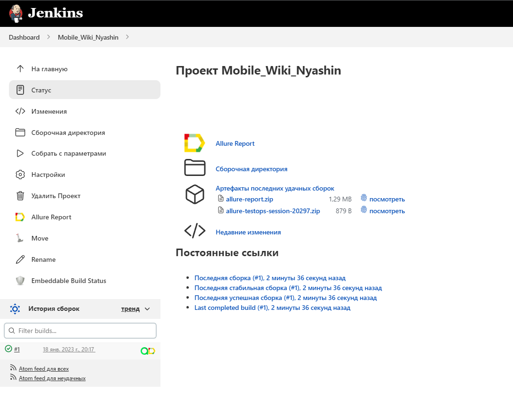
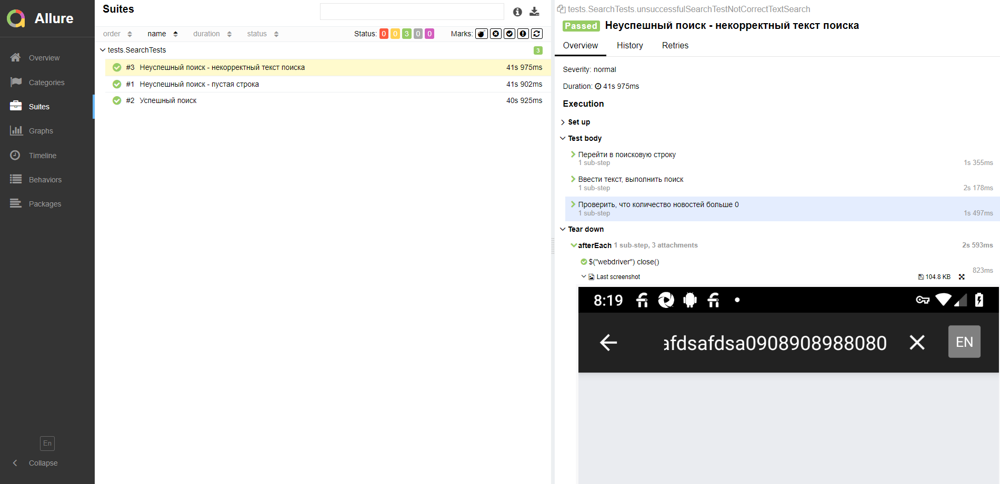
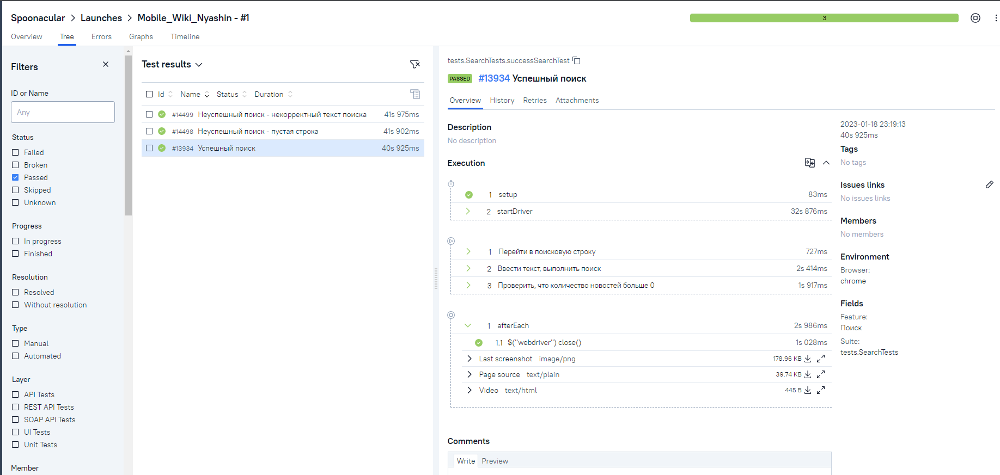
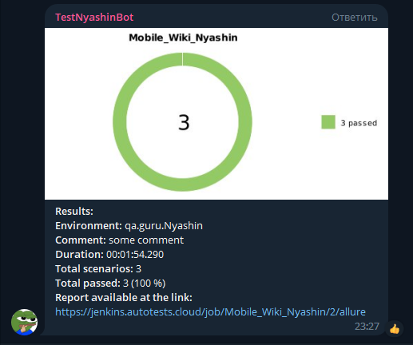

#  Автоматизация мобтльного приложения Wikipedia

##	Содержание

- [Технологии и инструменты](#technologist-технологии-и-инструменты)
- [Реализованныe проверки](#bookmark_tabs-реализованные-проверки)
- [Запуск тестов из терминала](#computer-запуск-тестов-из-терминала)
- [Запуск тестов в Jenkins](#-запуск-тестов-в-jenkins)
- [Отчет о результатах тестирования в Allure Report](#-отчет-о-результатах-тестирования-в-Allure-report)
- [Интеграция с Allure TestOps](#-интеграция-с-allure-testops)
- [Уведомления в Telegram с использованием бота](#-уведомления-в-telegram-с-использованием-бота)


## Технологии и инструменты
<p  align="center">

<code></code>
<code></code>
<code></code>
<code></code>
<code></code>
<code></code>
<code></code>
<code></code>
<code></code>
<code></code>
<code></code>

</p>

## :bookmark_tabs: Реализованные проверки:

- Успешный поиск статьи в приложении
- Проверка соотвествия страницы статьи, заданным параметрам поиска


## Запуск тестов из терминала

### Удаленный запуск тестов

```bash
gradle clean test 
-DdeviceHost=remote
```

### Локальный запуск тестов

```bash
gradle clean test
-DdeviceHost=local
```

##  Запуск тестов в Jenkins


<p align="center">
  
</p>


##  Отчет о результатах тестирования в Allure Report
<p align="center">
  
</p>


##  Интеграция с Allure TestOps

### Список тестов с результатами прогона

<p align="center">
  
</p>

##  Уведомления в Telegram с использованием бота
После завершения сборки специальный бот, созданный в <code>Telegram</code>, автоматически обрабатывает и отправляет сообщение с отчетом о прогоне тестов.

<p align="center">
